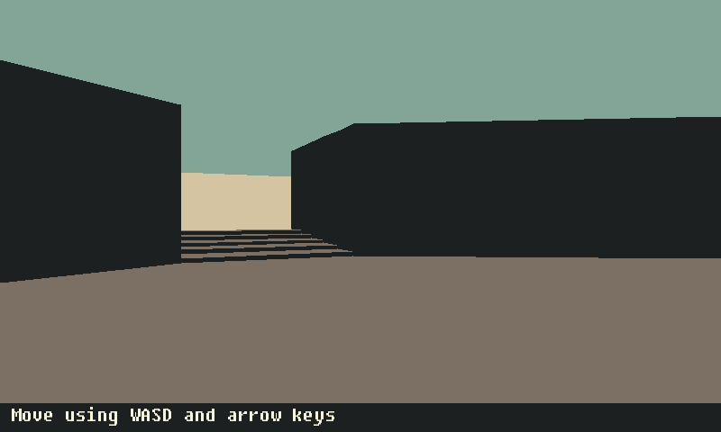
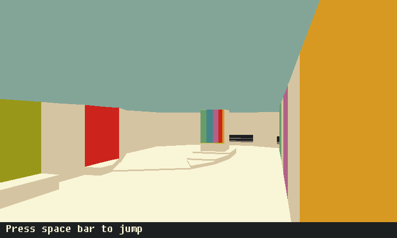

# 3droom
An experiment in non-eucleadian geometry

The 3d engine is modeled after the original doom game which modeled
the world as a series of connected rooms. Rooms are connected in such
a way that they can be easily rendered and can be moved between. but
are not geometrically possible.

# Requiremenst

- Python 2 or 3 (both work)
- Pygame

# Usage

    ./main.py
